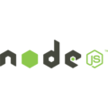

<h1 align="center">Proyecto N3</h1>

  

    

<h3 align="center"> Aplicación para listar, registrar y eliminar productos</h1>
## 🔖 Descripción
Challenge AluraGeek en donde se aplican conceptos importantes como la manipulación del DOM, el uso de *json-server*, la realización de requisiciones con *fetch* y a trabajar con programación asíncrona utilizando *async/await*. *italic*
