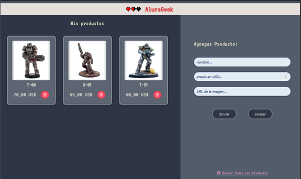

<h1 align="center">Proyecto N3</h1>

  

    

<h3 align="center"> Aplicación para listar, registrar y eliminar productos</h1>

## 🔖 Descripción

Challenge AluraGeek en donde se aplican conceptos importantes como la manipulación del DOM, el uso de *json-server*, la realización de requisiciones con *fetch* y a trabajar con programación asíncrona utilizando *async/await*.

## 🖍️ Funcionalidad

Es una aplicación en la cual se pueden ingresar productos mediante un formulario. A los productos se les puede asignar: nombre, precio y una imágen URL.
Cada tarjeta se puede eliminar individualmente o con una opción extra que permite borrar todos los productos en un solo click.

### ⌞ ⌝ ‎ Captura ‎ ⌞ ⌝

## 🪄 Utilizando la Aplicación

json-server ➘
Simulación de una api rest utilizando **Node js**

### ˙ᵕ˙ Tecnologías utilizadas

HTML, CSS y JavaScript.

# ╰┈➤ Author
**<h2 align="center"> ❀ ˖ ⋆  ݁ ‎  ݁‎[AvantNyx](https://github.com/AvantNyx)  ݁ ⋆ ˖ ❀</h2>**

